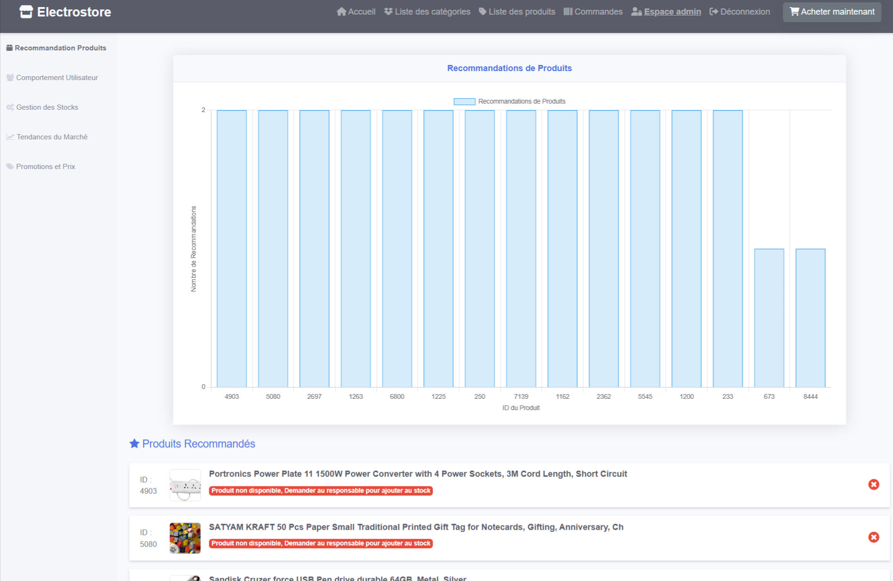
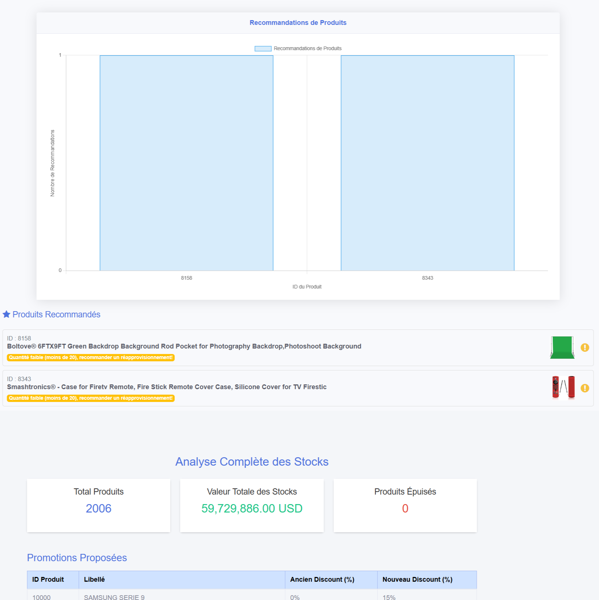

# ElectroStore(un système de recommandation dans un site e-commerce)

ElectroStore est une application de gestion de commerce électronique qui permet aux administrateurs de gérer les produits, les catégories, les commandes et les utilisateurs. Cette application est construite en PHP avec une base de données MySQL.

## Structure du projet

## Fonctionnalités
- **Système de recommandation** : Recommander des produits aux utilisateurs basés sur leurs interactions et préférences.
- **Gestion des produits** : Ajouter, modifier, supprimer et afficher les produits.
- **Gestion des catégories** : Ajouter, modifier, supprimer et afficher les catégories.
- **Gestion des commandes** : Valider et afficher les commandes.
- **Gestion des utilisateurs** : Ajouter et gérer les utilisateurs.
- **Tableau de bord** : Afficher les recommandations de produits et les alertes de stock.

## Améliorations

Nous avons  amélioré et intégré un système de recommandation dans ce site existant pour offrir une expérience utilisateur plus personnalisée.

## Captures d'écran

## Installation

1. Clonez le dépôt 
   

2. Accédez au répertoire du projet 
   

3. Configurez la base de données :
    - Importez le fichier SQL fourni dans votre serveur MySQL.
    - Mettez à jour les informations de connexion à la base de données dans le fichier [database.php](http://_vscodecontentref_/20).

4. Exécuter le code **API/app.py**

5. Démarrez le serveur web :
    - Utilisez un serveur local comme XAMPP ou WAMP pour exécuter l'application.

